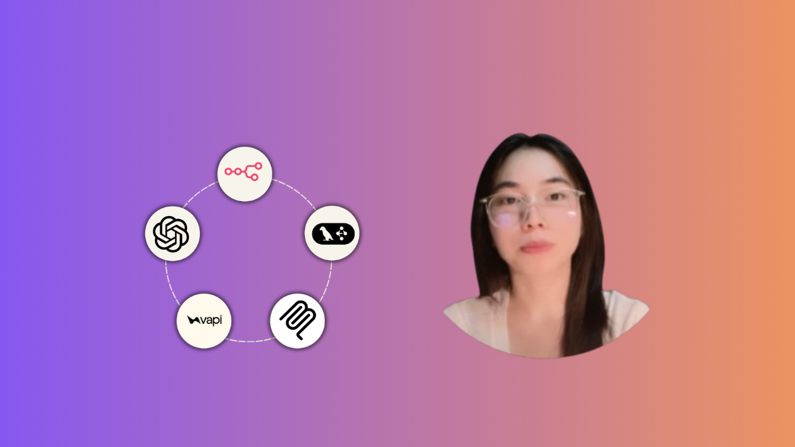

# 🤖 AI Agent Thực Chiến: n8n, Python SDK, MCP & LangGraph

**Tự động hoá kinh doanh với AI Agent — từ n8n no-code đến Python SDK, MCP Server và hệ Multi-Agent LangGraph.**

*Hành trình 5 tuần để tự xây dựng, triển khai và vận hành AI Agent thực chiến cho doanh nghiệp Việt Nam.*



> 💡 Nếu bạn đang xem file này trong Cursor hoặc VS Code, hãy click chuột phải vào tên file trong Explorer bên trái và chọn **"Open Preview"** để xem đúng định dạng.

---

## 👋 Chào mừng bạn!

Đây là kho tài liệu tham khảo chính thức đi kèm khoá học **"AI Agent Thực Chiến"** trên Udemy. Repo này chứa:

- 📖 Hướng dẫn setup môi trường chi tiết cho Windows / macOS / Linux
- 🔑 Hướng dẫn lấy toàn bộ API key cần dùng trong khoá học
- 📚 Các guide bổ sung (Python cơ bản, Async, MCP, so sánh framework...)
- 📂 Source code & tài liệu tham khảo theo từng tuần học
- ❓ Câu hỏi thường gặp và cách khắc phục lỗi phổ biến


---

## 🗺️ Lộ trình 5 tuần

| Tuần | Chủ đề | Công cụ chính | Bạn sẽ làm được gì |
|---|---|---|---|
| **1** | AI Agent No-Code | n8n Cloud | Xây AI Agent đầu tiên, kết nối Gmail/Sheets/Telegram/Slack, deploy Smart Business Dashboard |
| **2** | Self-Host & MCP nhập môn | n8n Docker, Ollama, MCP | Tự host n8n, chạy model miễn phí (DeepSeek/Ollama), xây hệ 4 Sub-agent CRM + Voice Agent |
| **3** | Lập trình Agent bằng Python | OpenAI Agents SDK | Async, multi-agent, structured outputs, guardrails, deploy lên HuggingFace Spaces |
| **4** | Model Context Protocol | MCP Server/Client (Python) | Tự xây MCP Server, kết nối dữ liệu thật, dự án hệ thống CSKH 4 AI nhân viên |
| **5** | Multi-Agent chuyên sâu | LangGraph | Supervisor Pattern, Worker-Evaluator, checkpointing, capstone TroLy.AI |

📌 Chi tiết từng bài học nằm trong README riêng của mỗi thư mục tuần — xem mục [Cấu trúc thư mục](#-cấu-trúc-thư-mục) bên dưới.

---

## ⚙️ Setup môi trường — việc đầu tiên bắt buộc phải làm

**Đừng vội code ngay!** Nếu bỏ qua bước setup, bạn rất dễ gặp lỗi thư viện, version không tương thích, hoặc "code chạy máy tôi mà không chạy máy bạn". Hãy setup đúng ngay từ đầu, dùng xuyên suốt cả khoá học.

| Hệ điều hành | Hướng dẫn |
|---|---|
| 🍎 macOS | [`setup/SETUP-mac.md`](./setup/SETUP-mac.md) |
| 🪟 Windows | [`setup/SETUP-PC.md`](./setup/SETUP-PC.md) |
| 🐧 Linux | [`setup/SETUP-linux.md`](./setup/SETUP-linux.md) |
| 🔑 API Keys (tất cả các key cần dùng) | [`setup/API-KEYS.md`](./setup/API-KEYS.md) |

Có vấn đề khi setup? Đừng tự loay hoay quá lâu — hỏi ngay trong phần Q&A của khoá học hoặc nhắn trực tiếp.

---

## 💸 Về chi phí API — đọc trước khi bắt đầu!

Khoá học có gọi đến OpenAI và một số model khác, cần API key và một khoản chi phí nhỏ (thường dưới **5 USD** cho toàn khoá nếu dùng model mini/nano). Nếu bạn muốn **tiết kiệm tối đa hoặc miễn phí hoàn toàn**, khoá học có hướng dẫn dùng:

- **DeepSeek / OpenRouter** — rẻ hơn OpenAI rất nhiều, nhiều model miễn phí
- **Ollama** — chạy model AI 100% offline trên máy, không tốn phí API
- **Groq** — tốc độ cực nhanh, có gói miễn phí

👉 Xem chi tiết tại [`guides/09_ai_apis_mien_phi_va_ollama.md`](./guides/09_ai_apis_mien_phi_va_ollama.md)

⚠️ Luôn theo dõi chi phí sử dụng của bạn tại [OpenAI Usage Dashboard](https://platform.openai.com/usage) để chủ động kiểm soát ngân sách.

---

## 📂 Cấu trúc thư mục

```
agentcourse/
├── README.md                      ← Bạn đang ở đây
├── LICENSE
├── environment.yml                 ← Cài môi trường bằng conda
├── requirements.txt                ← Cài môi trường bằng pip (không dùng conda)
├── .env.example                    ← Mẫu file khai báo API key
├── .gitignore
│
├── setup/                          ← Hướng dẫn cài đặt môi trường
│   ├── SETUP-mac.md
│   ├── SETUP-PC.md
│   ├── SETUP-linux.md
│   └── API-KEYS.md
│
├── guides/                         ← Tài liệu tham khảo bổ sung, đọc khi cần
│   ├── 01_intro.md
│   ├── 02_python_co_ban_cho_agent.md
│   ├── 03_async_python.md
│   ├── 04_n8n_vs_code_khi_nao_dung_cai_nao.md
│   ├── 05_mcp_tong_quan.md
│   ├── 06_so_sanh_framework_agent.md
│   ├── 07_debug_va_trace.md
│   ├── 08_troubleshooting.md
│   └── 09_ai_apis_mien_phi_va_ollama.md
│
├── week1/                              ← Tuần 1: AI Agent No-Code với n8n
│   └── README.md
├── week2/                              ← Tuần 2: Self-host, OAuth, MCP nhập môn
│   └── README.md
├── week3/                              ← Tuần 3: OpenAI Agents SDK (Python)
│   └── README.md
├── week4/                              ← Tuần 4: Model Context Protocol chuyên sâu
│   └── README.md
└── week5/                              ← Tuần 5: LangGraph & Multi-Agent
    └── README.md
```

> Mỗi thư mục `weekN_*` có file `README.md` liệt kê đầy đủ bài học, mô tả ngắn và các file/notebook liên quan trong tuần đó. Khi học đến tuần nào, hãy mở README của tuần đó trước tiên.

---

## 🚀 Bắt đầu nhanh (Quick Start)

```bash
# 1. Clone repo về máy
git clone https://github.com/tam1511/agentcourse.git
cd agentcourse

# 2. Tạo môi trường bằng conda (khuyến nghị)
conda env create -f environment.yml
conda activate agents-env

# --- Hoặc nếu không dùng conda, dùng pip + venv ---
python -m venv .venv
source .venv/bin/activate        # Windows: .venv\Scripts\activate
pip install -r requirements.txt

# 3. Tạo file .env và điền API key (xem setup/API-KEYS.md)
cp .env.example .env

# 4. Mở project bằng Cursor / VS Code
code .
```

Sau khi setup xong, mở thư mục `week1/` và bắt đầu học ngay! 🎉

---

## 🧰 Yêu cầu trước khi học

- Không cần biết lập trình để bắt đầu — Tuần 1 và Tuần 2 dùng n8n (kéo-thả, không cần code).
- Có kiến thức Python cơ bản sẽ giúp bạn tiếp thu nhanh hơn ở Tuần 3–5, nhưng **không bắt buộc** — có hướng dẫn từng dòng lệnh.
- Máy tính Windows/Mac/Linux kết nối Internet, tài khoản Gmail/Google để thực hành tích hợp.
- Không yêu cầu kinh nghiệm AI/Machine Learning trước đó.

---

## 🎯 Sau khoá học bạn sẽ làm được gì?

- Xây AI Agent tự động hoá quy trình kinh doanh bằng n8n — từ số 0 đến production.
- Tích hợp Agent với Gmail, Google Sheets, Telegram, Slack cho sales/CSKH/vận hành.
- Lập trình Agent bằng Python SDK: async, multi-agent, structured outputs, guardrails, deploy thật.
- Tự xây MCP Server/Client, kết nối Agent với dữ liệu và API thực tế của doanh nghiệp.
- Thiết kế hệ Multi-Agent chuyên nghiệp bằng LangGraph: Supervisor, checkpointing, capstone hoàn chỉnh.

---

## ❓ Câu hỏi thường gặp

| Câu hỏi | Trả lời ngắn |
|---|---|
| Tôi có thể dùng Gemini hoặc model miễn phí thay vì OpenAI không? | **Có!** Xem [`guides/09_ai_apis_mien_phi_va_ollama.md`](./guides/09_ai_apis_mien_phi_va_ollama.md) |
| Giao diện Cursor của tôi khác trong video? | Bình thường — Cursor cập nhật giao diện thường xuyên, các bước thao tác vẫn tương tự. |
| Tôi có cần biết lập trình trước không? | Không, 2 tuần đầu hoàn toàn no-code. Từ tuần 3 có hướng dẫn từng bước. |
| Học xong có thể làm gì? | Xây dịch vụ automation cho doanh nghiệp, tự động hoá quy trình công ty mình, hoặc chuyển hướng sang AI Engineering. |
| Tôi bị lỗi khi setup, phải làm sao? | Đọc kỹ [`guides/08_troubleshooting.md`](./guides/08_troubleshooting.md) trước, sau đó hỏi trong Q&A khoá học. |

---

## 📬 Kết nối & hỗ trợ

Mọi thắc mắc trong quá trình học, hãy đặt câu hỏi trực tiếp trong phần **Q&A của khoá học trên Udemy** — đó là nơi phản hồi nhanh nhất. 
Hoặc có thể liên hệ trực tiếp với mình qua **Email: timiofficial.vn@gmai.com** / **LinkedIn: https://www.linkedin.com/in/timi11/**

---

## 📜 License

Tài liệu và source code trong repo này được phát hành theo giấy phép [MIT License](./LICENSE) — tự do sử dụng, chỉnh sửa cho mục đích học tập và thương mại, miễn ghi nguồn.

---

### ✨ Trên hết —

Hãy tận hưởng khoá học! Bạn không thể chọn thời điểm nào tốt hơn để học về Agentic AI. Chúc bạn xây được thật nhiều Agent hữu ích! 🚀
